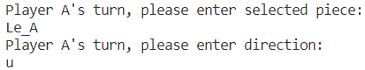

# Animal Chess
This is a simple CLI jungle game written in Java.

For the game rules, please refer to the description at https://en.wikipedia.org/wiki/Jungle_(board_game).

## System Architecture

## Class Diagram

## Game Control
In the game, the user only needs to enter two specific values per turn. The piece to be moved and the direction of the move. For ease of user input, pieces and directions will be in abbreviated form. Please see the information below.

|     Pieces      |     Player A    |     Player B    |
|-----------------|-----------------|-----------------|
|     Elephant    |     El_A        |     El_B        |
|     Lion        |     Li_A        |     Li_B        |
|     Tiger       |     Ti_A        |     Ti_B        |
|     Leopard     |     Le_A        |     Le_B        |
|     Wolf        |     Wo_A        |     Wo_B        |
|     Dog         |     Do_A        |     Do_B        |
|     Cat         |     Ca_A        |     Ca_B        |
|     Rat         |     Ra_A        |     Ra_B        |

### Direction
Enter the abbreviated form of the direction to decide which direction of movement.

|     Direction    |     Abbreviation    |
|------------------|---------------------|
|     Up           |     u               |
|     Down         |     d               |
|     Right        |     r               |
|     Left         |     l               |

### Example

## Game Board

The game board includes a 7 by 9 grid
1.	The player’s den
2.	The river
3.	The trap
4.	The player’s piece

## Game Process
The game will start on player A’s turn. After valid inputs of piece and direction. The game will continue to player B’s turn. If player enters an invalid input, the player is required to re-enter until the input is valid. Every capture must satisfy the capture requirements. Otherwise user is required to re-enter.

### Valid Movement

The image above shows a valid move for Player A. Player A moved the rat to the right.

### Invalid Movement

The image above shows an invalid move for Player B. Player B is required to re-enter.

### Valid Capture

The image above shows a valid capture for Player A. Player A used a rat to capture the opponent's elephant.

### Invalid Capture

The image above shows an invalid capture for Player B. Player B is required to re-enter. 

## Win Conditions
The game will end until one of the players enters the opponent’s den or captures all the opponent’s pieces.

### Enter opponent’s den

The image above shows that Player A wins by moving the piece to the opponent's lair.

### Capture all opponent’s pieces

The image above shows that Player A wins by capturing all of his opponent's pieces.

## Credit
Thanks to Xavier Leung and David Tang for subsequent improvement update and documentation on this game after the first commit.
